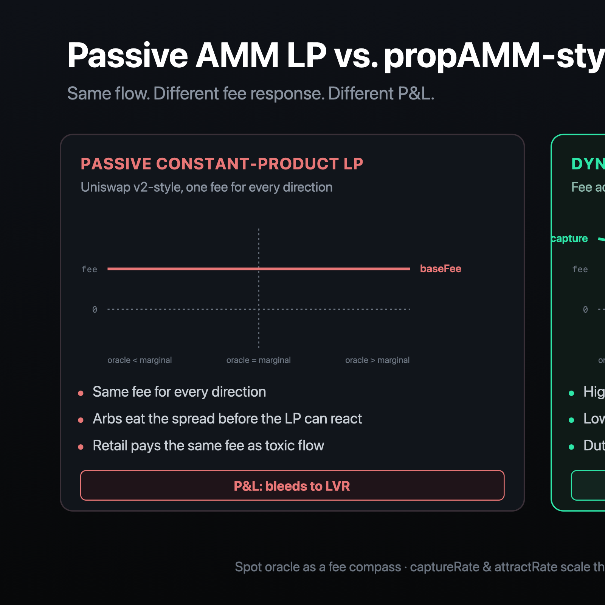
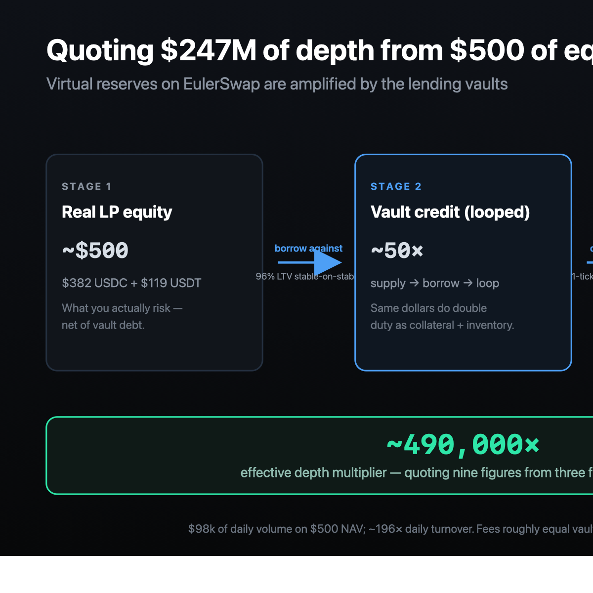
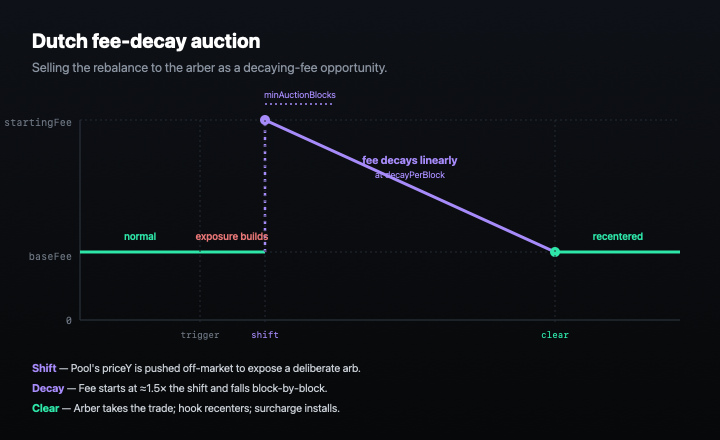

# How to run an active single-LP AMM on EulerSwap without a bot

## Introduction

Most AMM LPs lose to arbs. The textbook complaint — "you're just paying LVR" — assumes a passive constant-product position with one fee for every direction. Every directional move means the arber takes the spread before you can react, and you eat the inventory shift. Concentrated liquidity tightens depth but doesn't change the asymmetry.

This repo is one way out of that. It's an EulerSwap hook — a single ~1000-line Solidity contract — that runs **active single-LP liquidity provision**: one operator per pool, dynamic fees set against a Uniswap-spot oracle, Dutch fee-decay auctions for autonomous rebalancing. All on-chain, no off-chain bot for the core loop.

"Single operator, asymmetric fees, capture arb economics" is also the goal of the propAMM family (Titan, Sorella Angstrom, Arrakis HOT, Solana pAMMs). Those are builder-coordinated: an off-chain market maker streams signed quotes to a block builder, who sequences taker flow against the freshest quote each block. This hook starts from the opposite end — a fully public formula anyone can simulate from chain state — and then exposes an *optional* permissionless mechanism (`builderFee`, the fifth mechanism below) that invites a builder to bump the public fee on the LP's terms, sharing the captured spread back. That hybrid is its own design space, and `builderFee` is where this repo's research interests overlap with the propAMM frontier — closer to the propAMM end if and when a builder ever integrates, closer to "just a public formula" today.

Four mechanisms compound, with a fifth available as an optional opt-in. None is novel in isolation — what's interesting is that together they let a single LP autonomously price-discriminate by direction, source per-trade inventory ~25× their equity via credit, and rebalance without an off-chain bot.

**A note on what this post is.** It's a working proof-of-concept, not a finished design. The contracts run autonomously on a small live mainnet pool, the calibration tooling is solid, and the deploy path for a fresh pair is documented end-to-end with helper scripts that auto-detect what they can. But the empirical evidence is thin (one pool, 90 days, $500 NAV) and several of the mechanism choices have honest open-research alternatives. The post is structured as: (a) here's what it does today, (b) here's where the design is genuinely open, (c) here's how to collaborate. If you read past the live-numbers section, the **Open problems worth working on** section near the end is where the actually-interesting next-step questions sit. The goal is "this is cool, here are some further thoughts" — not "this is the finished article."



## Uniswap spot as a fee compass

The hook reads the deepest Uniswap pool's spot price on every quote — V3 `slot0()` or V4 `extsload` on the PoolManager. That gives the AMM a reference for *which direction* is profitable to arb.

You can't use spot as a **collateral** oracle — it's manipulable within a block, and the whole "Aave wouldn't take spot as a price feed" intuition is right. But you can use it as a **fee compass**, because:

- the hook never lowers the fee below `baseFee` — it only ever raises it
- an attacker who manipulates spot to inflate the AMM's quoted fee pays that fee on their own swap
- there's no direction the manipulation can profit them

Spot-as-fee-compass is the cheap, lazy, completely safe choice — and almost nobody uses it because the "spot is unsafe" framing got generalised too far. Full analysis: [`docs/uniswap-fee-compass.md`](https://github.com/euler-mab/eulerswap-hook/blob/main/docs/uniswap-fee-compass.md).

## Routing-aware asymmetric fees

With a fee compass, you can quote different fees in different directions. When the pool is offering an arb against itself, the hook **captures** the arb:

```
fee = baseFee + captureRate × oracleDelta
```

When the pool is competing for retail flow against a deeper venue, it **attracts** flow by quoting tighter than the reference Uniswap pool:

```
fee = baseFee − attractRate × externalFee
```

Asymmetric by design. Toxic flow pays for itself, retail flow gets a discount, and the LP isn't relying on a private fair-value model to tell them which is which — the spot oracle is the signal.

## Credit-backed depth

EulerSwap is the substrate. Each Euler account is its own AMM, with the same collateral that's earning lending yield doubling as swap liquidity. With LTVs up to 96% on stables, the pool can source per-trade inventory ~25× its equity in *either* direction by borrowing against the side it holds — long USDC and short USDT one minute, the opposite after enough flow the other way. The curve's "virtual reserves" (eq0/eq1) then shape the slippage *within* that capacity — large virtual reserves with concentration around a peg means near-1:1 pricing for trades inside the band. Per-trade capacity is still ultimately bounded by collateral × LTV, on whichever side the next trade is leaning.



The live USDC/USDT example: ~\$500 of equity in a sub-account (\$382 USDC + \$119 USDT). Per-trade capacity is order \$10k. The curve has virtual reserves of \$247M / \$242M which give very tight pricing within that capacity — but the \$247M number is a slippage-curve parameter, not a depth claim. The actually-interesting number is **daily turnover**: when flow is active, the auction recycles direction multiple times a day, taking volume well into multiples of equity. The pool's averaged ~\$46k/day over the last week on \$483 NAV (~95×). Flow is bursty — quiet days drop to zero, busy days exceed \$100k.

Every swap that adds inventory deposits to the supply vault or repays debt; every swap that drains inventory borrows from the borrow vault or withdraws supply. The pool's "real" footprint is small and directional. Auctions are what keep it from getting stuck.

That's the next problem.

## Dutch fee-decay auctions for rebalancing

When the LP's net base-asset position drifts past a threshold (a configurable fraction of NAV), the hook starts an auction. Three things happen, all autonomously from inside `afterSwap`:

1. **Shift.** The hook reconfigures the pool to a deliberately mispriced `priceY`. The shift size is taken from actual exposure (not a fixed magnitude), capped at `maxShiftMagnitude`. After the shift, the pool's marginal price is off from the oracle by a known amount — an arb opportunity priced into the curve.
2. **Decay.** The hook quotes a high starting fee (~1.5× the shift). Block by block, that fee decays toward `baseFee`. Arbers wait for it to be cheap enough to be profitable net of gas. Eventually one takes it.
3. **Clear.** The arber's trade pushes the marginal price back toward the oracle. Once convergence is detected (price diff < `clearThreshold`), the hook recenters the pool — eq = current reserves, priceY = oracle — and exits the auction. The arb spread has paid for the rebalance.



The clever bit is that **the rebalance is paid for by the arber**, not by the LP. A traditional LP would have to sell directional inventory on an external venue — eating slippage and the bid-ask. Here the arb spread *is* the rebalance, and the LP just chooses how much to charge for capturing it. Higher startingFee = more LP capture, longer wait. Lower decay rate = same shape, faster clear.

Convergence is measured on price (marginal vs oracle), not reserves — a direct read on whether the arb has been consumed. A `minAuctionBlocks` floor prevents the auction from clearing before the fee has had time to decay; otherwise the very first swap after the shift would clear at the starting fee, defeating the auction.

## Curvature surcharge — anti-round-trip

Every recenter creates a small kink in the curve. An attacker who anticipates a recenter (and there are many — recenters happen on most swaps that reduce exposure) can round-trip across the kink: trade in, wait for the recenter, trade out. The displacement-bonus the curve had just before the recenter is now extractable for free.

The hook adds an additive surcharge to the fee, sized **exactly** to the curvature bonus the recenter exposed, decaying to zero over a configurable horizon. The first swap after a recenter pays the full surcharge; by the time the curve has settled, the surcharge is back to zero. Round-trip extraction becomes unprofitable.

Plus a one-shot **deploy surcharge** — high at deployment, decaying over the first few hours, so a mispriced initial deploy is expensive to arb before the operator notices and corrects.

## Optional fifth mechanism: builder fee bump

The four mechanisms above are entirely public — anyone can simulate the fee from chain state. That's the right shape for an on-chain venue, but it leaves one thing on the table: a block builder with a private CEX-DEX signal knows the *real* fair-value spread on every block, and the public formula can't price that in.

The hook exposes an opt-in `setBuilderFee(fee)` that lets anyone — in practice the block builder, since they control transaction ordering — raise the quoted fee above the public floor for the current block. `getFee` returns `max(publicFee, builderFee)`, so the public floor is preserved by construction. A configurable share of the bumped delta accrues to the bumper as revenue split. Trustless: the floor can never be lowered; griefing (setting an unprofitable bump) costs gas with no return; self-trade bumps are net negative.

The four mechanisms above aren't redundant with `builderFee` — they're **layered defenses against different LVR sources**. The fee compass + asymmetric fees protect against directional toxicity from arbs trading against a stale public price; auctions clear accumulated exposure; the curvature surcharge prevents round-trip extraction across recenters; `builderFee` lets a builder with a private CEX-DEX signal price information the public formula can't see. If `builderFee` proves itself in the wild, **some of the public-formula parameters could be relaxed** (e.g. lower `captureRate`, looser `attractRate`) because the builder is already bidding the fair fee — but the auction, surcharge, and base floor remain load-bearing. They're each closing a different leak. Right now, with `builderFeeShareBps = 0` on the deployed example pool, the public mechanisms carry the full LVR-defense load. Full design: [docs/builder-fee-design.md](https://github.com/euler-mab/eulerswap-hook/blob/main/docs/builder-fee-design.md).

## Live numbers

The author runs one of these on Ethereum mainnet:

| | USDC/USDT |
|---|---|
| Pool | [`0x71...68A8`](https://etherscan.io/address/0x719529e99b7b272c5ef4ce07c30d15bc57cd68a8) |
| Hook | [`0x99...4e41`](https://etherscan.io/address/0x99b97FD05b4F943899358F90855C0BEE34584e41) |
| LP equity (NAV) | ~\$483 (started at \$501) |
| Volume (7d avg) | ~\$46k/day (bursty: \$0 – \$100k) |
| Daily turnover (7d avg) | ~95× |
| Lifetime volume | ~\$810k (187 swaps over ~90 days) |
| Lifetime fees collected | ~\$24 |
| Lifetime auctions (started / cleared) | 52+ / all clearing |
| P&L since live (~90 days) | -\$18 (-3.6%) |

The pool's running a small loss — quiet stretches accrue more borrow carry than the busy stretches' fees recover. The proof-of-principle here is that the *mechanism* works at all, not that \$500 is the right size to capture the upside. What the breakeven equity actually is — and how it depends on σ, the borrow rate, and the share of incoming flow that's retail vs arb — is an empirical question the live pool doesn't answer (and one of the open problems listed below).

## Plug into routing for free

An EulerSwap pool is automatically a Uniswap V4 hook, so any V4-aware aggregator sees it the moment it's deployed. Most major aggregators are already integrated — directly with EulerSwap or via V4 — including 1inch, CoW Protocol, and several Tycho-consuming routers. Registering your pool with [Euler's own orderflow router](https://github.com/euler-mab/eulerswap-hook/blob/main/contracts/script/RegisterPools.s.sol) — a one-tx call — surfaces it to Euler-integrating aggregators as well.

The retail flow that makes the attract-side fee profitable comes from this routing layer. Without it, the only counterparties you'd see are arbers.

## No off-chain bot

Every mechanism above runs on-chain, inside `getFee()` and `afterSwap()`. The hook reads the oracle, computes the fee, runs the auction state machine, and calls `pool.reconfigure()` to recenter — all from within EulerSwap's `afterSwap` callback, where the pool storage is unlocked.

That means: no keeper, no bot, no off-chain process needed to operate. The owner can call `setFeeParams` / `setAuctionParams` etc. to retune from time to time as the pair's flow profile clarifies, but that's a slow-timescale operation. The core loop is the hook.

This matters because the alternative — an off-chain agent that monitors the pool and submits rebalance txs — is brittle. Every keeper-driven design has the same failure modes: bot goes down, RPC flakes, gas price spikes, MEV bots front-run the rebalance. Moving the whole loop into `afterSwap` removes the entire off-chain failure surface.

## A reference you can deploy today

The hook, deploy scripts, calibration tooling, and design docs are at:

→ **[github.com/euler-mab/eulerswap-hook](https://github.com/euler-mab/eulerswap-hook)**

The deploy flow is env-driven end-to-end. Calibration takes a JSON profile and outputs paste-ready env vars; `DeployPool.s.sol` deploys the EulerSwap pool itself; `DeployHook.s.sol` deploys the hook and binds it; `RegisterPools.s.sol` opts you into Euler's orderflow router. The walkthrough at [`docs/build-your-own-active-lp.md`](https://github.com/euler-mab/eulerswap-hook/blob/main/docs/build-your-own-active-lp.md) covers every step end-to-end, including an anvil dry-run recipe so you can test the whole sequence against a forked mainnet without spending real ETH.

## Open problems worth working on

The mechanisms above are what the hook does today. Several of them are also genuine open research questions where the next step probably needs more than a clever refactor — and that's the part I'm most excited about. If any of these resonate, please open an issue or reach out:

1. **Bounding the give-up to private-orderflow searchers.** The fee compass is provably safe against an isolated arber: any manipulation pays the inflated fee on the manipulator's own swap. But a UniswapX-style filler holding private retail flow can manipulate the V3 reference *downward* and route that flow through the attract-side discount in the same block — capturing spread the LP should have won. The defensive monotonicity ("fee never lowers below `baseFee`") still holds, but the worst-case give-up vs an OFA-holding adversary hasn't been formally bounded. There's a real paper to write here.

2. **Sealed-bid clearing for the rebalance auction.** The current Dutch decay routes the arb to whoever has the lowest gas/latency. A sealed-bid mechanism — block builders submit signed bids each block, highest wins, LP captures the spread between top and second bid — would route more of that value back to the LP. This is the SUAVE / OFA design pattern applied to AMM rebalancing. Concrete next step: prototype as a v2 hook variant and measure the revenue uplift against the current Dutch design on a paired test pool.

3. **Variance-aware trigger thresholds.** `auctionTriggerThreshold = 50% of NAV` is clean for stables but doesn't scale gracefully to volatile pairs. A σ-aware adaptive trigger — fire when exposure exceeds `c · σ · √T` rather than a fixed NAV fraction — better reflects what's actually risky. The change is mechanically small; whether it matters in practice is an empirical question nobody's run yet.

4. **`builderFee` in the wild — the propAMM bridge.** The mechanism is implemented, tested, and dormant. Its forward thesis is that this hook is the *public-formula* base layer for a propAMM-style design, with the builder bid as the private-signal layer on top — keeping the LP's safety floor non-negotiable while letting a sophisticated bidder express better information when they have it. Whether that hybrid is actually competitive against a from-the-ground-up builder-coordinated AMM is the open question. First real integration produces the first empirical answer, and the data on what the public-formula floor is costing the LP each block in the meantime.

5. **Backtest, simulate, compare.** The live pool is 90 days at \$500 NAV. The realized distribution of outcomes at larger NAV, in different volatility regimes, against different competitor venues — all unobserved. A Monte Carlo over real historical mainnet flow (passive V3 vs. this hook vs. Yield Basis on the same swap-by-swap input) would tell us where the breakeven equity sits, which mechanism contributes most, and how the design behaves through fat-tailed periods like a stETH depeg or a 30% intraday move.

6. **LVR under credit amplification.** A 25× credit-amplified pool has 25× higher LVR exposure than the unleveraged version of the same trades, and the borrow carry compounds. The case study shows the directionally-correct outcome; what's missing is the analytic bound — "at NAV X with σ Y, expected LVR per day is Z, and fee capture needs to exceed it by W to be net positive." That's the equation a serious operator wants in their head before allocating real capital.

None of these are "we'll fix it later" placeholders. They're "we shipped what we knew how to ship; the rest is open and interesting." The hook is a working substrate for asking these questions — the contracts run, the calibration tooling is solid, and the deploy path for a fresh pair has helper scripts at every step. Now the interesting work is figuring out what the design *should* be.

## Be honest about the risks

This is experimental, unaudited reference code:

- **EulerSwap protocol** is [audited](https://github.com/euler-xyz/euler-swap/tree/master/audits) and has processed billions in production. **The hook on top of it is not.** Single-author research code, battle-tested only on the live \$500 NAV pool above.
- **Borrow rate volatility** can flip the math: at high vault utilization the carry cost on the directional leg rises and may exceed fee income. Monitor.
- **Spot oracle safety** assumes the invariant "fee is monotonically non-decreasing in oracle delta" — i.e., the hook only ever raises the fee, never lowers it. If you fork the hook, don't add code paths that lower the quoted fee in response to oracle signals.

If you're using this as a template, fork it, read it, get a security review of the hook contract and the exact deploy script you'll run. Don't deploy unmodified code with significant capital.

---

That's the design as it stands. The individual primitives — Dutch auctions, spot oracles, asymmetric fees, additive surcharges — aren't new. What's interesting is the integration: one autonomous hook that quotes directionally, deepens via vault credit, rebalances by letting an arber take a decaying spread, and leaves a permissionless door (`builderFee`) for a sophisticated bidder to price information the public formula can't see. All on-chain, all rule-based, no bot.

Treat this as a starting point, not a finished answer. The hook is a working substrate for the research questions in the Open Problems section above — every one of those is more interesting than getting the current parameters exactly right, and several of them probably have better answers than the choices this repo ships with. If any of the open problems resonate, or if you spot something that's just wrong, the issue tracker is the right place. The goal is to compound on what's here, not defend it.

For the broader design-space context (Fluid DEX, Yield Basis, Uniswap V3 JIT, where this hook sits), see the [README design-space section](https://github.com/euler-mab/eulerswap-hook#where-this-sits-in-the-design-space). For the per-mechanism derivations, [`docs/uniswap-fee-compass.md`](https://github.com/euler-mab/eulerswap-hook/blob/main/docs/uniswap-fee-compass.md), [`docs/dynamic-fee-model.md`](https://github.com/euler-mab/eulerswap-hook/blob/main/docs/dynamic-fee-model.md), [`docs/auction-walkthrough.md`](https://github.com/euler-mab/eulerswap-hook/blob/main/docs/auction-walkthrough.md), and [`docs/builder-fee-design.md`](https://github.com/euler-mab/eulerswap-hook/blob/main/docs/builder-fee-design.md). For the live pool's lifetime numbers, [`docs/case-study-usdc-usdt.md`](https://github.com/euler-mab/eulerswap-hook/blob/main/docs/case-study-usdc-usdt.md).
